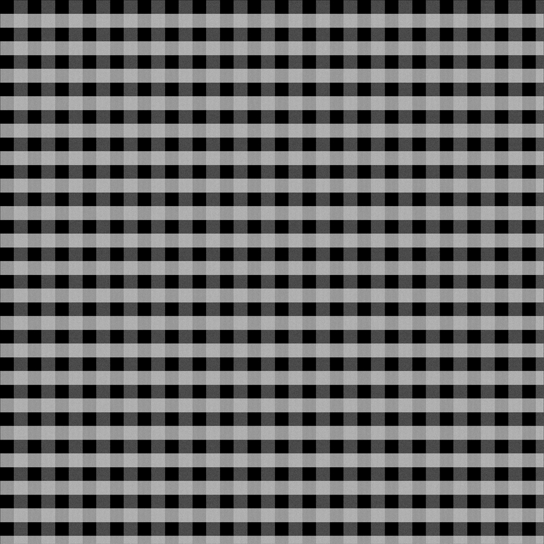
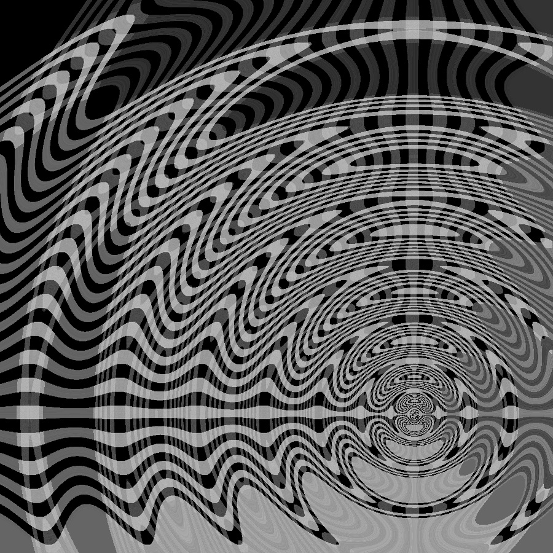
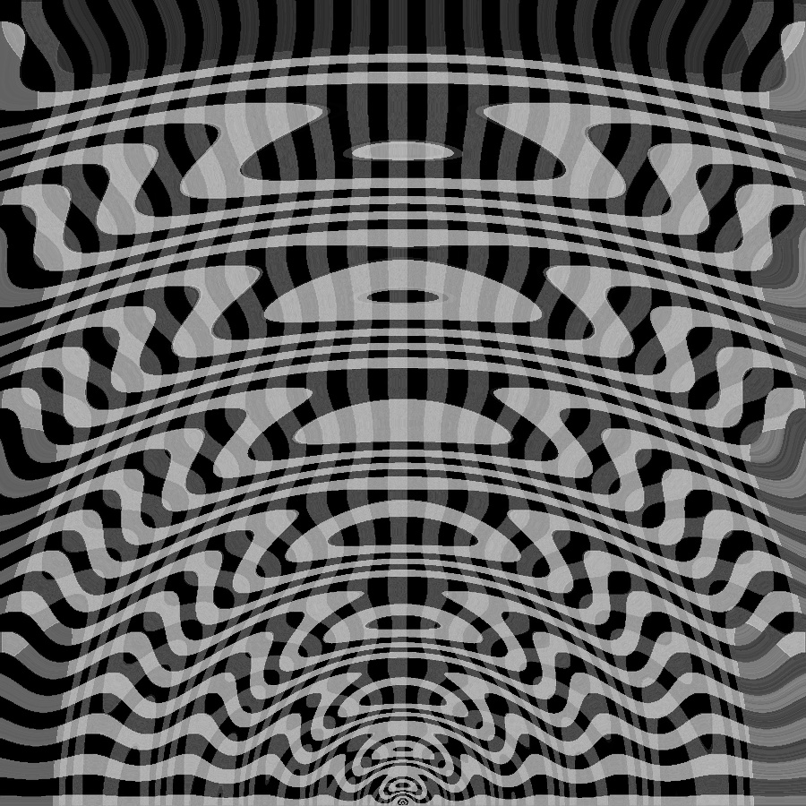

# py_lens
Rust based python package to apply a wave distortion filter to an image.

<table>
<tr>
<td width="33%">Base image</td>
<td width="33%">wave_point(image, cx=0.75, cy=0.75, u=0.2)</td>
<td width="33%">wave_point(image, cx=1, cy=0.5, u=0.07)</td>
</tr>
<tr>

<td></td>
<td></td>
<td></td>


</tr>
<tr>
<td>Base image without modification <br> Created in GIMP</td>
<td>Wave starts in top left (0,0 position) with 25x strength</td>
<td>Wave starts in the lower centre position (900px&nbsp;down, 450px&nbsp;across) with a 100x&nbsp;strength modifier</td>
</tr>
<tr><td colspan="3"></td> </tr>

<tr>
<td>Base image</td>
<td>windowed_rms_single(image, window_size=12)</td>
<td>windowed_stdev_single(image, window_size=32, ddof1=True)</td>
</tr>
<tr>
<td></td>
<td></td>
<td></td>
</tr>


</table>


### Building with maturin
` maturin build -f -r -b cffi ` 

### Running in python

```python
import py_lens
import cv2
import numpy

image: numpy.ndarray = cv2.imread(r"/images/G1.jpg", cv2.IMREAD_COLOR)
image_wave = py_lens.apply_lens(image, cx=1, cy=0.5, U=100)
cv2.imshow('G1-1-05-100.jpeg', image_wave)
cv2.waitKey()
```


---

Below is the 1 dimensional version of the 2d wave form used in `py_lens.apply_lens()` 
where the x dimension is the distance between [x,y] and [cx,cy]. The wave function has rotational symmetry around the [cx,cy] point.


---

```python
def apply_lens(py_img: numpy.ndarray, cx: float, cy: float, U: float) -> numpy.ndarray:
    """    
    :param py_img: input image, shape must be [x size, y size, 3],
    :param cx: centre location of the wave function in x - positions 0<x<1 will be treated as a fraction of the total image width
    :param cy: centre location of the wave function in y - positions 0<x<1 will be treated as a fraction of the total image height
    :param U: wave intensity
    :return: image with wave function applied
    """
```
